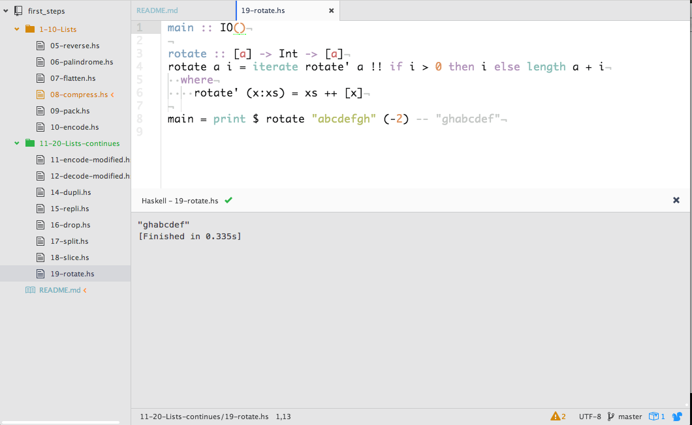

# Ninety-Nine Haskell Problems

https://wiki.haskell.org/99_questions

## The problems

### 1 to 10: Lists

* [05. Reverse a list](1-10-Lists/05-reverse.hs)
* [06. Find out whether a list is a palindrome](1-10-Lists/06-palindrome.hs)
* [07. Flatten a nested list structure](1-10-Lists/07-flatten.hs)
* [08. Eliminate consecutive duplicates of list elements](1-10-Lists/08-compress.hs)
* [09. Pack consecutive duplicates of list elements into sublists](1-10-Lists/09-pack.hs)
* [10. Run-length encoding of a list](1-10-Lists/10-encode.hs)

### 11 to 20: Lists, continued
